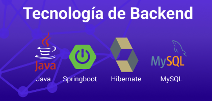
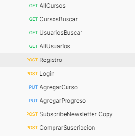
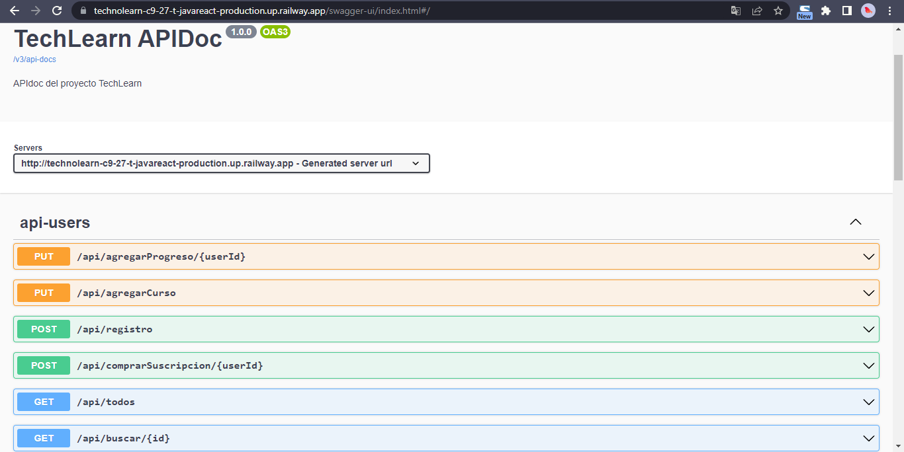

# Backend TechnoLearn 

Se utilizo la api de youtube para scrapear informacion de playlist de los cursos para ingresar a la bases de datos

## Tecnologias Utilizadas

  

 * Java 17 
 * SpringBoot 3
 * Hibernate(default ORM Springboot)
 * MySQL

 ## Funcionalidades
 

  

 * Buscar todos los cursos de la bases de datos.
 * Buscar un curso especifico segun el id de la bases de datos.
 * Buscar un usuario segun el id de la bases de datos.
 * Buscar todos los usuarios.
 * Registro para guardar un usuario a la bases de datos.
 * Login.
 * Agregar curso a un usuario.
 * Agregar progreso al curso de un usuario.
 * Suscribir a la persona al newsletter.
 * Comprar la suscripción.

 Para hacer las consultas utilizamos Springboot data JPA, y en el login argon para hashear la contraseña en la db , para validar el numero de tarjeta de credito el algoritmo de Luhn y para mandar mail en el newsletter y la compra de la suscripcion usamos la libreria java mail sender.

## Documentacion de la api

Para la documentacion de la API usamos la libreria de Swagger-UI para auto-generarla.

  

 ### **Puedes ver la documentacion de la api generada con Swagger-UI [Aqui]( https://technolearn-c9-27-t-javareact-production.up.railway.app/swagger-ui/index.html#/).**